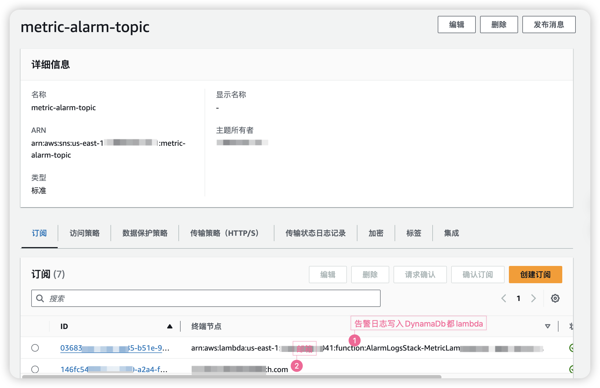
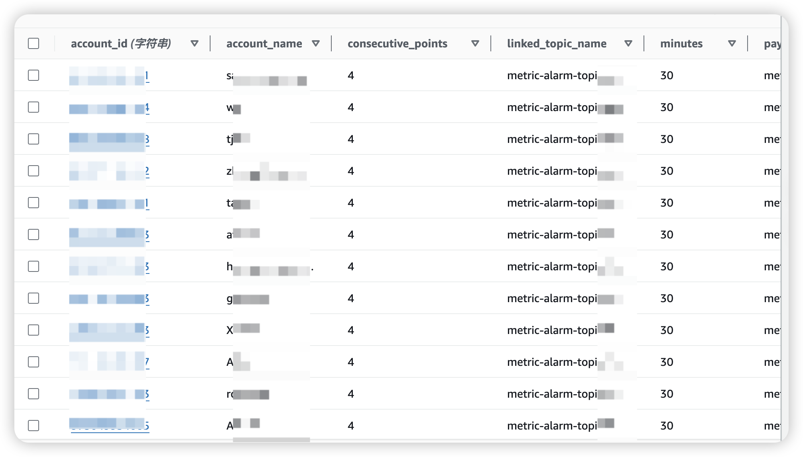
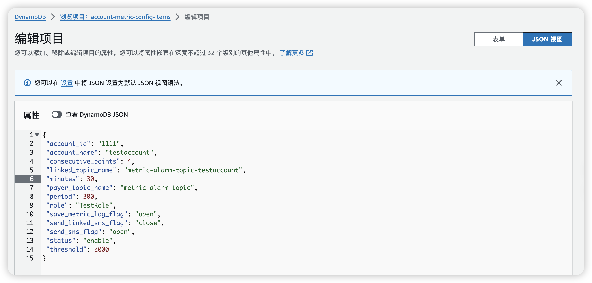

# introduce
AWS CloudFront alarm that the total number of requests within a period of time exceeds the standard

Please run `cdk deploy --all` to deploy this stack in your AWS account.
# deploy
## Manually create SNS


Note:
- TOPIC Name of sns must be consistent with the following topic configuration data
- Creating a subscription can be set up as a final step.
## Deploy CDK application
```
cdk deploy --all
```

This project will create
* Cloud Watch EventBridge
*Two Lambda Function
*Two DynamoDB Table

## Set up The configuration data for Linked Account in the DynamoDB Table

table name: account-metric-config-items


Example Record: 
```
{
 "account_id": "11111",
 "account_name": "testaccount",
 "consecutive_points": 4,
 "linked_topic_name": "metric-alarm-topic-zhangzhongyun",
 "minutes": 30,
 "payer_topic_name": "metric-alarm-topic",
 "period": 300,
 "role": "testrole",
 "save_metric_log_flag": "open",
 "send_linked_sns_flag": "close",
 "send_sns_flag": "open",
 "status": "enable",
 "threshold": 2000
}
```



Note:
- 
# code
## lambda code
```
lambda-code/
     └── metric collection & alarm lambda
         ├── index.py lambda main function
         ├── metric.py business logic body: collecting indicators and alarms
```
## Code debugging
It is recommended to run python directly
```
Modify input parameters, run metric.py, etc.
```
## CDK code
```
lib
└── metric-alarm-stack.ts reads configuration, collects indicators, and alarms
└── metric-alarm-stack.ts writes alarm log
```