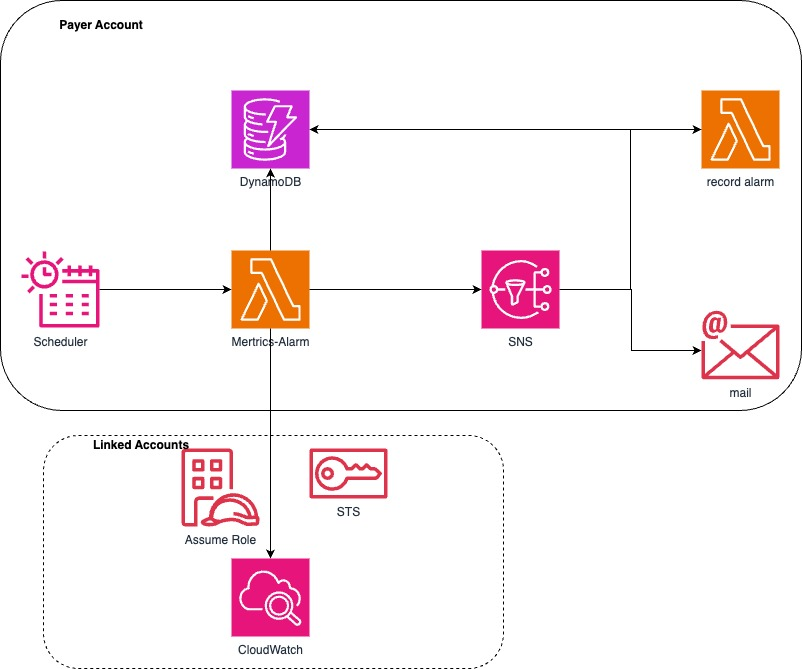

# Introduction

AWS Partners serves some gaming customers who face an increasing number of cyber threats. In some cases, these threats have resulted in substantial bills, causing customers to flee due to their inability to pay. We have evaluated Partners' solutions to address these issues and attempted to use Prometheus+Grafana combined with the Cloudwatch exporter for monitoring. However, Partners have pointed out that this solution requires a significant amount of work when dealing with numerous Linked Accounts, such as configuring a separate Datasource and Dashboard in Grafana for each Linked Account, as well as configuring numerous alert parameters, resulting in a high learning curve. Therefore, our solution aims to address the following problems:

1. Key Metric Monitoring and Alerting
   We will monitor critical network and application metrics, such as request count, download traffic, and error rates, based on AWS CloudWatch. Once an anomaly is detected, the system will automatically trigger an alert and send the alert information to designated operations personnel via SNS.
2. Automated Deployment and Configuration
   By automating deployment, we reduce the workload of configuration. Our solution leverages CDK and account configuration extensions in DynamoDB to minimize manual intervention and improve efficiency.

# Solution Features

1. **Scalability**: Due to the use of a serverless architecture (AWS Lambda), the system can automatically scale based on demand without the need for pre-configuration or infrastructure management.
2. **Cross-Account Access**: Through linked accounts and role assumption mechanisms, the system can monitor and manage resources across multiple AWS accounts.
3. **Integration**: The system integrates multiple AWS services, such as DynamoDB, SNS, and CloudWatch, providing comprehensive monitoring, alerting, and notification capabilities.
4. **Reliability**: By utilizing AWS managed services, the system's reliability and availability are enhanced.
5. **Flexibility**: The architecture can be extended and customized based on requirements, such as adding more monitoring metrics, alert rules, or notification channels.
6. **Cost-Effectiveness**: By adopting a serverless architecture, resources are consumed only when needed, reducing operational costs.

# Architecture Diagram



This architecture diagram illustrates a monitoring and alerting system based on AWS services. The main components and processes of the system are as follows:

1. **Scheduler**: A scheduler, which could be an AWS Lambda function or an Amazon EventBridge rule, used to periodically trigger monitoring tasks.
2. **MetricsAlarm**: An AWS Lambda function responsible for collecting and analyzing metric data, and generating alerts based on predefined thresholds.
3. **DynamoDB**: An Amazon DynamoDB database used to store alert configurations and alert event records.
4. **Record alarm**: A component, which could be another AWS Lambda function, used to record generated alerts into other systems or services.
5. **SNS**: An Amazon Simple Notification Service (SNS) topic used to send alert notifications.
6. **Mail**: An email service used to receive alert notifications sent by the SNS topic.
7. **Linked Accounts**: A concept of linked accounts, allowing the system to access and manage resources across multiple AWS accounts.
8. **Assume Role**: An AWS Lambda function used to assume the role of a linked account, granting access to resources in other accounts.
9. **CloudWatch**: The Amazon CloudWatch service used to collect and monitor metrics data from AWS resources.
10. **STS**: The AWS Security Token Service (STS), used to manage temporary security credentials, enabling cross-account access.

# Deployment

## Prerequisites

* Node.js 16+
* AWS CDK CLI
* An AWS Account
* Administrator or equivalent privilege

## 1. Deploy the CDK Application

```
cdk deploy --all
```

This project will create:

* Cloud Watch EventBridge
* Two Lambda Functions
* Two DynamoDB Tables

## 2. Manually Create SNS


Note:

- The TOPIC should match the configuration data below
- Creating a subscription can also be done in the last step

## 3. Set Linked Account Configuration Data in DynamoDB

table name: account-metric-config-items

Example Record:

```
{
 "account_id": "11111",
 "account_name": "testaccount",
 "consecutive_points": 4,
 "linked_topic_name": "metric-alarm-topic-zhangzhongyun",
 "minutes": 30,
 "payer_topic_name": "metric-alarm-topic",
 "period": 300,
 "role": "testrole",
 "save_metric_log_flag": "open",
 "send_linked_sns_flag": "close",
 "send_sns_flag": "open",
 "status": "enable",
 "threshold": 2000
}
```


Note:

- You can write a program to automatically retrieve all accounts under the payer and write them to DynamoDB
- You can write a program to automatically create SNS topics based on the configuration
- payer_topic_name must match the SNS topic created in step 1
- Alerts from all Linked Accounts will be sent to payer_topic_name
- If send_linked_sns_flag is set to "open", you need to create an SNS topic for the Linked Account, and the topic must match linked_topic_name. This topic will only receive alerts from this account

# Code

## Lambda Code

```
lambda-code/
    └── metric                 Lambda for metric collection & alerting
        ├── index.py           Lambda main function
        ├── metric.py          Main business logic: metric collection, alerting
```

## Code Debugging

It is recommended to run Python directly

```
Modify the input parameters and run metric.py, etc.
```

## CDK Code

```
lib
└── metric-alarm-stack.ts   Read configuration, collect metrics, alert
└── metric-alarm-stack.ts   Write alert logs
```
